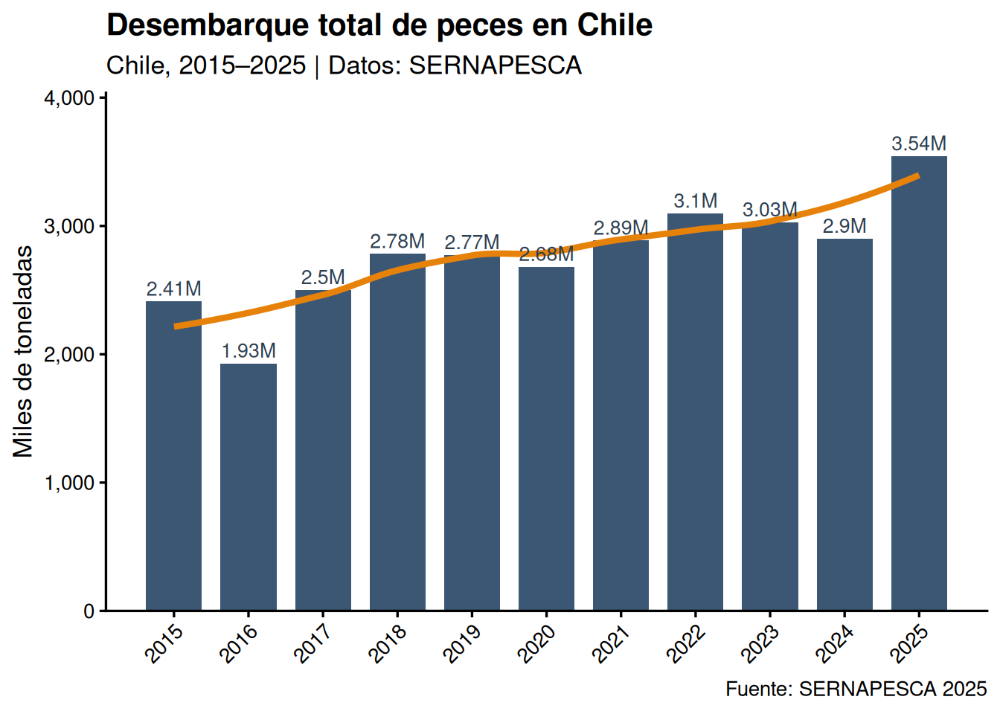
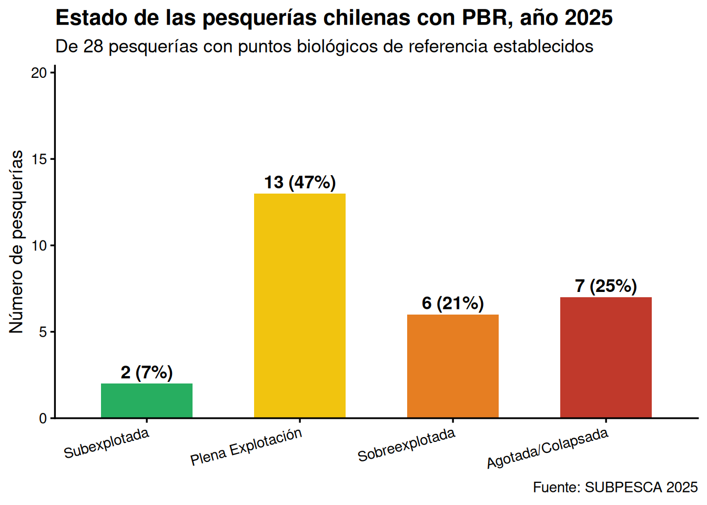

# Introducción a los Recursos Marinos {#intro}


> **¿Cómo usar esta guía?** Lee cada sección, presta atención a los cuadros de definición (⬛), los ejemplos (📌) y las preguntas de autoevaluación (❓). Al final de cada sección encontrarás respuestas breves a las preguntas más frecuentes y referencias para profundizar.

## ¿Qué es la Biología de Recursos? {#que-es}

### Definición de recurso

Un **recurso** es todo elemento que puede utilizarse como medio para alcanzar un fin determinado. En el contexto de la Biología de Recursos Pesqueros, nos interesan específicamente los **recursos naturales** de origen acuático marino.

> **Definición clave:** Los **recursos naturales** son elementos de la naturaleza utilizados para cubrir necesidades biológicas, económicas, sociales, estéticos o espirituales. Incluyen seres vivos (fauna, flora) y elementos abióticos (agua, luz solar, minerales).

Los recursos naturales se pueden clasificar en cuatro grandes categorías:

| Tipo de recurso | Descripción | Ejemplos |
|-----------------|-------------|---------|
| **No renovables** | Se agotan con el uso; tiempo de regeneración geológico | Petróleo, carbón, minerales metálicos |
| **Renovables vivos** | Pueden regenerarse si el uso es menor a la tasa de reproducción | Peces, algas, bosques |
| **Renovables no vivos** | Se regeneran naturalmente en ciclos relativamente cortos | Agua, suelos fértiles |
| **Inagotables** | Su uso no disminuye la disponibilidad | Energía solar, viento, mareas |

### La distinción renovable / no renovable

Esta distinción es fundamental en la Biología de Recursos:

**Recurso no renovable:** Se agota con su utilización y no puede ser producido, cultivado o extraído indefinidamente. La escala temporal de regeneración es geológica (millones de años), por lo que, desde la perspectiva humana, son finitos.

**Recurso renovable:** No se agota con su uso *racional*, pues es capaz de volver a su estado original o se reproduce a una tasa mayor que la tasa de uso. **La clave está en la condición: el uso debe ser menor o igual a la tasa de renovación.**

> ⚠️ **Advertencia conceptual:** Un recurso renovable puede comportarse como no renovable si la tasa de extracción supera de forma sostenida su capacidad de regeneración. Esto es precisamente lo que ocurre en las pesquerías sobreexplotadas o agotadas.

📌 **Ejemplo:** La anchoveta (*Engraulis ringens*) es un recurso renovable con alta tasa reproductiva. Sin embargo, las pesquerías que operaron intensivamente durante la década de 1970–1980 colapsaron stocks en el norte de Chile y Perú. El recurso **puede** recuperarse si se reduce la presión de pesca a tiempo.

### La Biología de Recursos como disciplina

La Biología de Recursos es esencialmente una disciplina **poblacional**: su objeto de estudio no es el individuo sino la **población** y sus propiedades emergentes (abundancia, estructura, productividad).

> **Definición:** La Biología de Recursos estudia las poblaciones de organismos acuáticos explotados comercialmente, con el fin de entender su dinámica, estimar su abundancia y productividad, y proveer información científica para su manejo sustentable.

Las principales áreas de estudio son:

1. **Biogeografía:** Distribución espacial regional y local de poblaciones. Permite definir las *unidades de pesquería* (áreas geográficas dentro de las cuales un stock se gestiona como unidad).

2. **Demografía:** Estructura de tallas y edades, parámetros de crecimiento (modelo de von Bertalanffy), reproducción (talla de primera madurez, fecundidad, periodo reproductivo), mortalidades (natural *M* y por pesca *F*).

3. **Dinámica poblacional:** Tasas de renovación (asentamiento larval, reclutamiento al stock explotable), productividad poblacional. Incluye modelos de producción excedente, análisis de cohortes y modelos edad-estructurados.

4. **Ecología:** Relaciones tróficas (depredación, competencia, parasitismo), rol trófico en la trama alimentaria, efectos del ambiente (temperatura, oxígeno, surgencia, ENSO) sobre la distribución y abundancia.

5. **Pesquería:** Artes y equipos de pesca, flota pesquera (industrial y artesanal), esfuerzo de pesca, captura por unidad de esfuerzo (CPUE), destino de los recursos.

6. **Manejo de Pesquerías:** Regulaciones, conservación, regímenes de explotación, Puntos Biológicos de Referencia (PBR), enfoque precautorio, enfoque ecosistémico para el manejo de la pesca y la acuicultura.

### ❓ Preguntas de autoevaluación — Sección 1

1. ¿Cuál es la diferencia fundamental entre un recurso natural renovable y uno no renovable?
2. ¿Bajo qué condición un recurso renovable puede comportarse como no renovable?
3. ¿Cuáles son las seis áreas principales de la Biología de Recursos y qué estudia cada una?
4. ¿Por qué se dice que la Biología de Recursos es esencialmente "poblacional"?

---

## Recursos Acuáticos Renovables {#rec-acuaticos}

### El medio marino como fuente de recursos

Chile posee condiciones oceanográficas excepcionales para la producción de recursos marinos, principalmente gracias al **Sistema de la Corriente de Humboldt** (o Corriente de Chile-Perú):

- **Upwelling costero:** Las surgencias traen aguas frías, ricas en nutrientes desde la profundidad, estimulando la producción primaria (fitoplancton).
- **Elevada productividad:** La producción primaria sustenta redes tróficas complejas con alta biomasa de peces, moluscos y crustáceos.
- **Alta diversidad:** La combinación de gradiente latitudinal (clima tropical a subantártico) y condiciones oceanográficas genera gran diversidad de hábitats y especies.

> 🌊 **Dato:** Chile tiene una Zona Económica Exclusiva (ZEE) de ~3,7 millones de km² y ~6.435 km de costa continental. Es uno de los 10 mayores productores pesqueros del mundo.

### Clasificación de recursos acuáticos renovables

Los recursos acuáticos renovables se dividen en:

**Aguas continentales:**
- Peces nativos de ríos y lagos (pejerrey, trucha, puye)
- Crustáceos de agua dulce
- Algas de agua dulce

**Recursos marinos renovables** (foco principal del curso):
- Peces pelágicos y demersales
- Moluscos (cefalópodos, bivalvos, gasterópodos)
- Crustáceos (langostinos, centolla, centollón)
- Algas macroscópicas (huiro, cochayuyo, luga)
- Equinodermos (erizo de mar, pepino de mar)
- Tunicados (piure)

---

## Clasificación de los Recursos Marinos Renovables {#clasificacion}

### Clasificación taxonómica

Los recursos marinos comercialmente importantes en Chile se agrupan taxonómicamente así:

**Peces pelágicos pequeños** (*small pelagics*)

- Anchoveta (*Engraulis ringens*): recurso histórico del norte, base de la industria de harina y aceite de pescado
- Sardina común (*Strangomiza bentincki*): Regiones V–X, altamente variable
- Sardina austral (*Sprattus fuegensis*): Regiones X–XII
- Caballa (*Scomber japonicus*): alta variabilidad, tendencia creciente desde 2015

**Peces pelágicos grandes**

- Jurel (*Trachurus murphyi*): actualmente el recurso de mayor desembarque nacional (>1,2 millones ton en 2025)
- Pez espada / albacora (*Xiphias gladius*): pesca de altura con palangre

**Peces demersales**

- Merluza común (*Merluccius gayi gayi*): demersal de plataforma, región central
- Merluza del sur (*M. australis*): región austral, aguas más profundas
- Congrio dorado, colorado y negro (*Genypterus* spp.)
- Bacalao de profundidad (*Dissostichus eleginoides*)

**Crustáceos (*Crustacea*)**

- Langostino amarillo (*Cervimunida johni*): pesquería industrial, regiones IV–IX
- Langostino colorado (*Pleuroncodes monodon*): pesquería industrial, regiones III–IX
- Camarón nailon (*Heterocarpus reedi*): aguas profundas
- Centolla (*Lithodes santolla*): Patagonia y Magallanes (XII–XI)
- Centollón (*Paralomis granulosa*): zonas australes

**Moluscos (*Mollusca*)**

- Jibia (*Dosidicus gigas*): pesca artesanal e industrial, toda la costa
- Loco (*Concholepas concholepas*): icónico recurso bentónico, gestionado mediante AMERB
- Chorito / mejillón (*Mytilus chilensis*): principalmente de cultivo, Región de Los Lagos
- Ostión del norte (*Argopecten purpuratus*): principalmente de cultivo

**Equinodermos (*Echinodermata*)**

- Erizo de mar (*Loxechinus albus*): importante recurso bentónico, principalmente en Regiones X y XI
- Pepino de mar (*Athyonidium chilensis*)

**Algas macroscópicas**

- Huiro (*Macrocystis pyrifera*, *Lessonia* spp.): exportación de alginatos
- Cochayuyo (*Durvillaea antarctica*): consumo humano y exportación
- Luga roja (*Gigartina* spp.): carragenanos

### Clasificación por hábitat: Zonación del medio marino

El **dominio pelágico** es la columna de agua, alejado del fondo marino. Se subdivide según la profundidad:

- **Zona epipelágica (0–200 m):** bien iluminada, mayor productividad.
- **Zona mesopelágica (200–1.000 m):** límite de penetración de la luz.
- **Zona batipelágica (1.000–4.000 m):** oscuridad permanente.

El **dominio bentónico** comprende el fondo marino y la columna de agua adyacente:

- **Zona supramareal (supralitoral):** expuesta al aire la mayor parte del tiempo.
- **Zona mesolitoral (intermareal):** expuesta con la bajamar, sumergida con la pleamar.
- **Zona infralitoral (submareal):** permanentemente sumergida bajo el nivel más bajo de la marea.

📌 **Ejemplo:** El loco (*Concholepas concholepas*) es un gasterópodo carnívoro altamente sedentario. Su dispersión ocurre únicamente en la fase larval pelágica (~3–4 semanas). Este ciclo de vida determina que las subpoblaciones locales sean relativamente independientes en el corto plazo, lo que hace esencial gestionar la especie a escala local (área de manejo).

---

## Las Pesquerías Tipo "S" {#tipo-s}

El término fue acuñado por **Orensanz et al. (2005)** para referirse a:

> ***"Small-Scale, Spatially-Structured, Supported by Sedentary Stocks"***
> *"Pesquerías artesanales, espacialmente estructuradas y sostenidas por stocks sedentarios"*

Las pesquerías tipo "S" son **dominantes en el litoral chileno** y representan la base económica de miles de comunidades costeras.

Sus características fundamentales son: operan con embarcaciones pequeñas (< 12 m de eslora), los stocks están organizados como metapoblaciones conectadas por dispersión larval, los adultos son poco móviles o sésiles, y sustentan la actividad económica de comunidades completas de pescadores artesanales.

### Estrategias de manejo: AMERB

La principal herramienta de gestión para pesquerías tipo "S" en Chile son las **Áreas de Manejo y Explotación de Recursos Bentónicos (AMERB)**:

- Delimitación legal de un área marina costera en uso exclusivo de una organización de pescadores artesanales
- La organización financia evaluaciones periódicas del recurso (planes de manejo)
- Permite el **co-manejo:** los pescadores participan en vigilancia, control y toma de decisiones
- Genera incentivos para la conservación

---

## Importancia Pesquera de Chile {#importancia}

### Desembarque nacional 2015–2025


``` r
anos   <- 2015:2025
total  <- c(2410579,1928598,2500562,2782188,2773500,
            2681998,2886478,3096605,3028375,2900536,3541604)

df_tot <- data.frame(YY = anos, Total_mil = total/1000)

ggplot(df_tot, aes(x = YY, y = Total_mil)) +
  geom_col(fill = "#1A3A5C", alpha = 0.85, width = 0.75) +
  geom_smooth(method = "loess", color = "#E6820A", linewidth = 1.5, se = FALSE) +
  geom_text(aes(label = paste0(round(Total_mil/1000,2),"M")),
            vjust = -0.4, size = 3.5, color = "#2C3E50") +
  scale_x_continuous(breaks = 2015:2025) +
  scale_y_continuous(labels = label_comma(),
                     expand  = expansion(mult = c(0, 0.14))) +
  labs(title   = "Desembarque total de peces en Chile",
       subtitle = "Chile, 2015–2025 | Datos: SERNAPESCA",
       x = NULL, y = "Miles de toneladas",
       caption = "Fuente: SERNAPESCA 2025") +
  theme_classic(13) +
  theme(plot.title   = element_text(face = "bold"),
        axis.text.x  = element_text(angle = 45, hjust = 1))
```

```
## `geom_smooth()` using formula = 'y ~ x'
```

<div class="figure">

<p class="caption">(\#fig:desembarques-fig)Desembarque total de peces en Chile, 2015-2025. Fuente: SERNAPESCA 2025</p>
</div>

### Distribución geográfica de las pesquerías

| Zona | Recursos característicos |
|------|--------------------------|
| **Norte (I–III)** | Anchoveta, sardina española, langostino colorado, jibia |
| **Centro-Norte (IV–V)** | Langostino amarillo y colorado, anchoveta, pez espada |
| **Centro (V–VIII)** | Merluza común, sardina común, anchoveta, jibia, jurel |
| **Centro-Sur (VIII–X)** | Jurel, sardina austral, merluza del sur, moluscos bivalvos |
| **Sur (X–XI)** | Almeja, erizo, cholga, centollón, loco, salmónidos cultivo |
| **Austral (XII)** | Centolla, merluza austral, merluza de cola, bacalao |

---

## Estado de las Pesquerías Nacionales 2025 {#estado-2025}

### Puntos Biológicos de Referencia (PBR)

Los **PBR** son valores estandarizados que permiten determinar el estado de situación de una pesquería:

- **B~RMS~**: biomasa al Rendimiento Máximo Sostenible.
- **B~límite~**: biomasa por debajo de la cual el stock no tiene capacidad de recuperación adecuada.
- **F~RMS~**: mortalidad por pesca al nivel del RMS.

> **Definición (LGPA Art. 2):** El RMS es el mayor nivel promedio de remoción por captura que se puede obtener de un stock en forma sostenible en el tiempo y bajo las condiciones ecológicas y ambientales predominantes.

### Estados de situación (LGPA Art. 2, N°59)


``` r
df_estados <- data.frame(
  Estado = c("Subexplotada","Plena Explotación","Sobreexplotada","Agotada o Colapsada"),
  Criterio_Biomasa = c("B > B_RMS","B ≈ B_RMS","B < B_RMS","B < B_límite"),
  Criterio_F = c("F < F_RMS","F ≈ F_RMS","F > F_RMS","Capturas mínimas históricas"),
  Implicancia = c(
    "Potencial para mayor rendimiento; puede aumentarse el esfuerzo cautelosamente",
    "Stock en o cerca de su rendimiento máximo; mantener esfuerzo",
    "No sostenible a largo plazo; riesgo de colapso si no se reduce F",
    "Stock sin capacidad de recuperación natural adecuada; veda o drástica reducción"
  )
)

kable(df_estados,
      caption = "Estados de situación de pesquerías según LGPA Art. 2 N°59",
      col.names = c("Estado","Criterio (Biomasa)","Criterio (F/U)","Implicancia para el manejo")) %>%
  kable_styling(bootstrap_options = c("striped","hover"), full_width = TRUE) %>%
  row_spec(1, color = "#155724", background = "#D4EDDA") %>%
  row_spec(2, color = "#856404", background = "#FFF3CD") %>%
  row_spec(3, color = "#721c24", background = "#F8D7DA") %>%
  row_spec(4, color = "#FFFFFF", background = "#721c24")
```

<table class="table table-striped table-hover" style="margin-left: auto; margin-right: auto;">
<caption>(\#tab:estados-table)(\#tab:estados-table)Estados de situación de pesquerías según LGPA Art. 2 N°59</caption>
 <thead>
  <tr>
   <th style="text-align:left;"> Estado </th>
   <th style="text-align:left;"> Criterio (Biomasa) </th>
   <th style="text-align:left;"> Criterio (F/U) </th>
   <th style="text-align:left;"> Implicancia para el manejo </th>
  </tr>
 </thead>
<tbody>
  <tr>
   <td style="text-align:left;color: rgba(21, 87, 36, 1) !important;background-color: rgba(212, 237, 218, 1) !important;"> Subexplotada </td>
   <td style="text-align:left;color: rgba(21, 87, 36, 1) !important;background-color: rgba(212, 237, 218, 1) !important;"> B &gt; B_RMS </td>
   <td style="text-align:left;color: rgba(21, 87, 36, 1) !important;background-color: rgba(212, 237, 218, 1) !important;"> F &lt; F_RMS </td>
   <td style="text-align:left;color: rgba(21, 87, 36, 1) !important;background-color: rgba(212, 237, 218, 1) !important;"> Potencial para mayor rendimiento; puede aumentarse el esfuerzo cautelosamente </td>
  </tr>
  <tr>
   <td style="text-align:left;color: rgba(133, 100, 4, 1) !important;background-color: rgba(255, 243, 205, 1) !important;"> Plena Explotación </td>
   <td style="text-align:left;color: rgba(133, 100, 4, 1) !important;background-color: rgba(255, 243, 205, 1) !important;"> B ≈ B_RMS </td>
   <td style="text-align:left;color: rgba(133, 100, 4, 1) !important;background-color: rgba(255, 243, 205, 1) !important;"> F ≈ F_RMS </td>
   <td style="text-align:left;color: rgba(133, 100, 4, 1) !important;background-color: rgba(255, 243, 205, 1) !important;"> Stock en o cerca de su rendimiento máximo; mantener esfuerzo </td>
  </tr>
  <tr>
   <td style="text-align:left;color: rgba(114, 28, 36, 1) !important;background-color: rgba(248, 215, 218, 1) !important;"> Sobreexplotada </td>
   <td style="text-align:left;color: rgba(114, 28, 36, 1) !important;background-color: rgba(248, 215, 218, 1) !important;"> B &lt; B_RMS </td>
   <td style="text-align:left;color: rgba(114, 28, 36, 1) !important;background-color: rgba(248, 215, 218, 1) !important;"> F &gt; F_RMS </td>
   <td style="text-align:left;color: rgba(114, 28, 36, 1) !important;background-color: rgba(248, 215, 218, 1) !important;"> No sostenible a largo plazo; riesgo de colapso si no se reduce F </td>
  </tr>
  <tr>
   <td style="text-align:left;color: rgba(255, 255, 255, 1) !important;background-color: rgba(114, 28, 36, 1) !important;"> Agotada o Colapsada </td>
   <td style="text-align:left;color: rgba(255, 255, 255, 1) !important;background-color: rgba(114, 28, 36, 1) !important;"> B &lt; B_límite </td>
   <td style="text-align:left;color: rgba(255, 255, 255, 1) !important;background-color: rgba(114, 28, 36, 1) !important;"> Capturas mínimas históricas </td>
   <td style="text-align:left;color: rgba(255, 255, 255, 1) !important;background-color: rgba(114, 28, 36, 1) !important;"> Stock sin capacidad de recuperación natural adecuada; veda o drástica reducción </td>
  </tr>
</tbody>
</table>

### Resumen del estado 2025 (SUBPESCA)


``` r
df_pbr <- data.frame(
  Estado = factor(c("Subexplotada","Plena Explotación","Sobreexplotada","Agotada/Colapsada"),
                  levels = c("Subexplotada","Plena Explotación","Sobreexplotada","Agotada/Colapsada")),
  N      = c(2,13,6,7),
  Pct    = c(7,47,21,25),
  Color  = c("#27AE60","#F1C40F","#E67E22","#C0392B")
)

ggplot(df_pbr, aes(x = Estado, y = N, fill = Estado)) +
  geom_col(width = 0.6, show.legend = FALSE) +
  geom_text(aes(label = paste0(N," (",Pct,"%)")),
            vjust = -0.4, fontface = "bold", size = 4.5) +
  scale_fill_manual(values = df_pbr$Color) +
  scale_y_continuous(expand = expansion(mult = c(0, 0.2)), limits = c(0,17)) +
  labs(title   = "Estado de las pesquerías chilenas con PBR, año 2025",
       subtitle = "De 28 pesquerías con puntos biológicos de referencia establecidos",
       x = NULL, y = "Número de pesquerías",
       caption = "Fuente: SUBPESCA 2025") +
  theme_classic(13) +
  theme(plot.title  = element_text(face = "bold"),
        axis.text.x = element_text(angle = 15, hjust = 1))
```

<div class="figure">

<p class="caption">(\#fig:estado-2025-fig)Estado de las pesquerías chilenas con PBR definido, 2025. Fuente: SUBPESCA 2025</p>
</div>

**Datos clave del informe SUBPESCA 2025:**

- De 48 pesquerías nacionales, **28 tienen PBR definido**.
- El 54% se encuentra en condición saludable (subexplotada o plena explotación).
- El 46% está en condición preocupante (sobreexplotada o agotada).

---

## Glosario de términos esenciales {#glosario}


``` r
glosario <- data.frame(
  Término = c("Recurso renovable","Biología de Recursos","Biomasa (B)","Mortalidad por pesca (F)",
               "RMS","B_RMS","F_RMS","PBR","LGPA","CCT","Pesquería tipo 'S'","AMERB","CPUE",
               "Reclutamiento","Unidad de pesquería","Metapoblación"),
  Definición = c(
    "Recurso natural que puede regenerarse si la tasa de extracción es menor a la de reproducción.",
    "Disciplina que estudia poblaciones de organismos acuáticos explotados para proveer bases del manejo sustentable.",
    "Masa total del stock explotable expresada en toneladas.",
    "Fracción de la biomasa que muere anualmente por causa de la pesca.",
    "Rendimiento Máximo Sostenible: mayor nivel promedio de captura sostenible en el tiempo.",
    "Nivel de biomasa al que se logra el RMS; referencia objetivo de manejo.",
    "Tasa de mortalidad por pesca al nivel del RMS.",
    "Punto Biológico de Referencia: valor estandarizado que define el estado de situación de la pesquería.",
    "Ley General de Pesca y Acuicultura (N° 18.892): marco normativo de la actividad pesquera en Chile.",
    "Comité Científico Técnico Pesquero: órgano asesor que define el estado de situación y los PBR.",
    "Pesquería artesanal, espacialmente estructurada, sustentada por stocks sedentarios (Orensanz et al., 2005).",
    "Área de Manejo y Explotación de Recursos Bentónicos: derechos de acceso territoriales.",
    "Captura por Unidad de Esfuerzo: índice de abundancia relativa = Captura / Esfuerzo.",
    "Individuos jóvenes que se incorporan al stock explotable al alcanzar la talla/edad de primera captura.",
    "Área geográfica dentro de la cual un stock se evalúa y gestiona como unidad.",
    "Conjunto de subpoblaciones locales de la misma especie conectadas por dispersión larval."
  )
)
kable(glosario, col.names = c("Término","Definición"),
      caption = "Glosario de términos esenciales — Clase 1") %>%
  kable_styling(bootstrap_options = c("striped","hover","condensed"), full_width = TRUE, font_size = 13) %>%
  column_spec(1, bold = TRUE, width = "25%")
```

<table class="table table-striped table-hover table-condensed" style="font-size: 13px; margin-left: auto; margin-right: auto;">
<caption style="font-size: initial !important;">(\#tab:glosario-table)(\#tab:glosario-table)Glosario de términos esenciales — Clase 1</caption>
 <thead>
  <tr>
   <th style="text-align:left;"> Término </th>
   <th style="text-align:left;"> Definición </th>
  </tr>
 </thead>
<tbody>
  <tr>
   <td style="text-align:left;width: 25%; font-weight: bold;"> Recurso renovable </td>
   <td style="text-align:left;"> Recurso natural que puede regenerarse si la tasa de extracción es menor a la de reproducción. </td>
  </tr>
  <tr>
   <td style="text-align:left;width: 25%; font-weight: bold;"> Biología de Recursos </td>
   <td style="text-align:left;"> Disciplina que estudia poblaciones de organismos acuáticos explotados para proveer bases del manejo sustentable. </td>
  </tr>
  <tr>
   <td style="text-align:left;width: 25%; font-weight: bold;"> Biomasa (B) </td>
   <td style="text-align:left;"> Masa total del stock explotable expresada en toneladas. </td>
  </tr>
  <tr>
   <td style="text-align:left;width: 25%; font-weight: bold;"> Mortalidad por pesca (F) </td>
   <td style="text-align:left;"> Fracción de la biomasa que muere anualmente por causa de la pesca. </td>
  </tr>
  <tr>
   <td style="text-align:left;width: 25%; font-weight: bold;"> RMS </td>
   <td style="text-align:left;"> Rendimiento Máximo Sostenible: mayor nivel promedio de captura sostenible en el tiempo. </td>
  </tr>
  <tr>
   <td style="text-align:left;width: 25%; font-weight: bold;"> B_RMS </td>
   <td style="text-align:left;"> Nivel de biomasa al que se logra el RMS; referencia objetivo de manejo. </td>
  </tr>
  <tr>
   <td style="text-align:left;width: 25%; font-weight: bold;"> F_RMS </td>
   <td style="text-align:left;"> Tasa de mortalidad por pesca al nivel del RMS. </td>
  </tr>
  <tr>
   <td style="text-align:left;width: 25%; font-weight: bold;"> PBR </td>
   <td style="text-align:left;"> Punto Biológico de Referencia: valor estandarizado que define el estado de situación de la pesquería. </td>
  </tr>
  <tr>
   <td style="text-align:left;width: 25%; font-weight: bold;"> LGPA </td>
   <td style="text-align:left;"> Ley General de Pesca y Acuicultura (N° 18.892): marco normativo de la actividad pesquera en Chile. </td>
  </tr>
  <tr>
   <td style="text-align:left;width: 25%; font-weight: bold;"> CCT </td>
   <td style="text-align:left;"> Comité Científico Técnico Pesquero: órgano asesor que define el estado de situación y los PBR. </td>
  </tr>
  <tr>
   <td style="text-align:left;width: 25%; font-weight: bold;"> Pesquería tipo 'S' </td>
   <td style="text-align:left;"> Pesquería artesanal, espacialmente estructurada, sustentada por stocks sedentarios (Orensanz et al., 2005). </td>
  </tr>
  <tr>
   <td style="text-align:left;width: 25%; font-weight: bold;"> AMERB </td>
   <td style="text-align:left;"> Área de Manejo y Explotación de Recursos Bentónicos: derechos de acceso territoriales. </td>
  </tr>
  <tr>
   <td style="text-align:left;width: 25%; font-weight: bold;"> CPUE </td>
   <td style="text-align:left;"> Captura por Unidad de Esfuerzo: índice de abundancia relativa = Captura / Esfuerzo. </td>
  </tr>
  <tr>
   <td style="text-align:left;width: 25%; font-weight: bold;"> Reclutamiento </td>
   <td style="text-align:left;"> Individuos jóvenes que se incorporan al stock explotable al alcanzar la talla/edad de primera captura. </td>
  </tr>
  <tr>
   <td style="text-align:left;width: 25%; font-weight: bold;"> Unidad de pesquería </td>
   <td style="text-align:left;"> Área geográfica dentro de la cual un stock se evalúa y gestiona como unidad. </td>
  </tr>
  <tr>
   <td style="text-align:left;width: 25%; font-weight: bold;"> Metapoblación </td>
   <td style="text-align:left;"> Conjunto de subpoblaciones locales de la misma especie conectadas por dispersión larval. </td>
  </tr>
</tbody>
</table>

---

## Preguntas de Autoevaluación {#autoevaluacion}

**Nivel básico (conceptos)**

1. Define con tus propias palabras qué es un recurso natural renovable y da dos ejemplos marinos.
2. ¿Cuáles son los cuatro estados de situación de una pesquería según la LGPA? Define cada uno.
3. ¿Qué son los Puntos Biológicos de Referencia (PBR) y para qué sirven?
4. ¿Qué diferencia hay entre el dominio pelágico y el dominio bentónico?

**Nivel intermedio (aplicación)**

5. El jurel pasó de ~289 mil toneladas en 2015 a 1,24 millones en 2025. ¿Qué factores biológicos y de manejo podrían explicar este aumento?
6. La sardina austral cayó de 31.393 ton (2015) a 7.736 ton (2025). ¿En qué estado de situación crees que podría encontrarse y por qué?
7. ¿Por qué las pesquerías bentónicas sin PBR se asimilan a estado de plena explotación?

**Nivel avanzado (análisis crítico)**

8. Si el 46% de las pesquerías con PBR están en estado de sobreexplotación o agotamiento, ¿qué nos dice esto sobre la efectividad del manejo pesquero en Chile?
9. Compara las estrategias de manejo para pesquerías pelágicas versus pesquerías tipo "S". ¿Por qué requieren enfoques diferentes?
10. ¿Cómo podría afectar el cambio climático al estado de las pesquerías chilenas en los próximos 20–30 años?

---

## Referencias {#referencias-intro}

- SUBPESCA (2025). *Estado de Situación de las Principales Pesquerías Chilenas, Año 2025.* Ministerio de Economía, Fomento y Turismo.
- Orensanz, J.M., Ernst, C. & Parma, D.A. (2005). Craft and science in the management of Patagonian scallop fisheries. *Bulletin of Marine Science* 76(2):527–556.
- Zagal, C.J. & Hermosilla, C. (2007). *Guía de Invertebrados Marinos del Litoral Bentónico de Chile.* Universidad de Antofagasta.
- SERNAPESCA (2025). *Anuario Estadístico de Pesca y Acuicultura 2025.* Ministerio de Economía.
- Hilborn, R. & Walters, C.J. (1992). *Quantitative Fisheries Stock Assessment.* Chapman and Hall.
