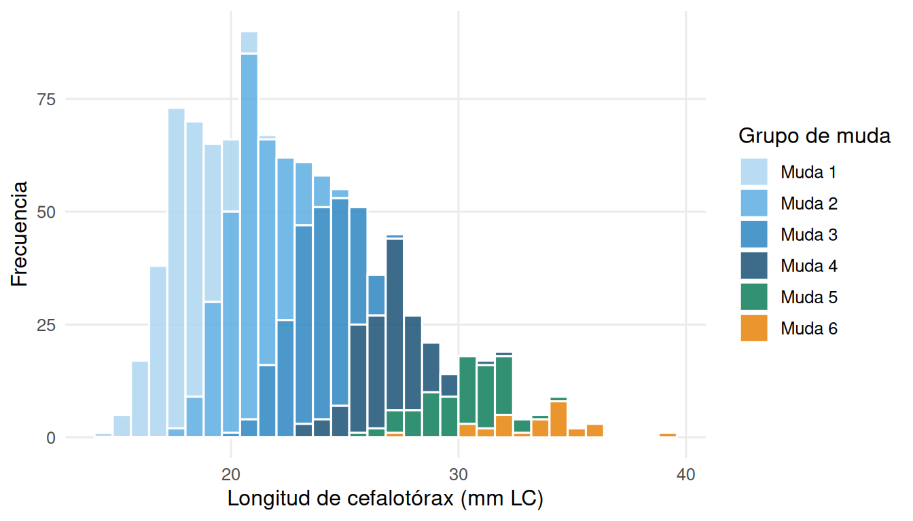
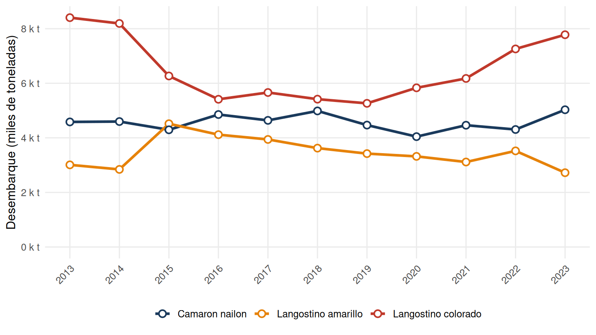
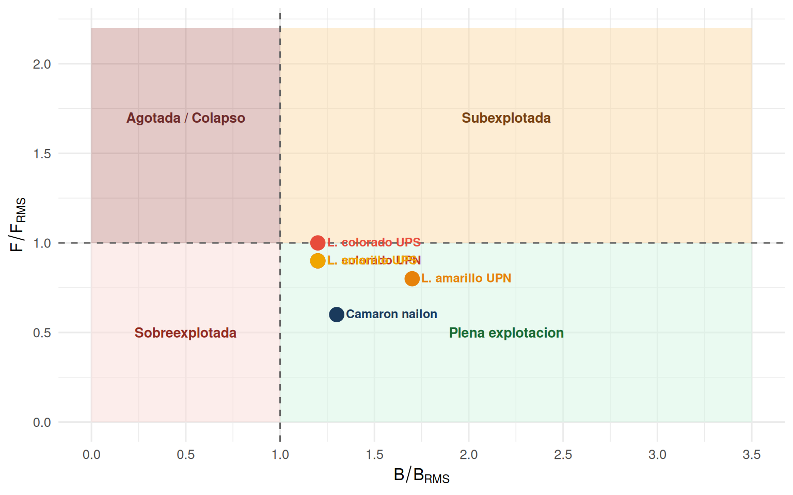

# Recursos Acuáticos Renovables: Crustáceos Demersales {#crustaceos}


> **¿Cómo usar este capítulo?** Lee cada sección con atención a los recuadros de definición, los datos cuantitativos y las preguntas de autoevaluación al final. Los gráficos y tablas se generan desde datos reales de SERNAPESCA y SUBPESCA.

## Los recursos acuáticos renovables {#acuaticos-renovables}

Un **recurso acuático renovable** es todo organismo que habita el medio acuático y que, bajo condiciones de uso moderado, puede regenerarse mediante su propia reproducción. Esta capacidad de renovación no es ilimitada: cuando la extracción supera la tasa de producción natural, el stock disminuye progresivamente hasta el agotamiento.

Los recursos acuáticos renovables de interés pesquero se clasifican en tres grandes grupos:

- **Peces**: recursos de mayor volumen de captura global (anchoveta, jurel, merluza).
- **Crustáceos**: invertebrados con exoesqueleto quitinoso; incluyen especies de alto valor comercial (langostinos, camarón, centolla).
- **Moluscos**: bivalvos, gastrópodos y cefalópodos; destacan el loco (*Concholepas concholepas*), el ostión y el calamar.

Este capítulo se enfoca en los **crustáceos demersales** de Chile, en particular los tres recursos de mayor importancia pesquera en la zona centro-norte.

## Especies objetivo: crustáceos demersales {#especies-crustaceos}

### Clasificación taxonómica y distribución

Las pesquerías industriales de arrastre de fondo en Chile centro-norte se centran en tres especies:


``` r
spp <- data.frame(
  Nombre_comun  = c("Langostino colorado","Langostino amarillo","Camaron nailon"),
  Nombre_cientifico = c("*Grimothea monodon*","*Grimothea johni*","*Heterocarpus reedi*"),
  Taxonomia = c("Anomura, Munididae","Anomura, Munididae","Decapoda, Pandalidae"),
  Profundidad = c("80–400 m","80–500 m","100–600 m"),
  Distribucion = c("II–VIII Region","II–VIII Region","III–XI Region")
)
kable(spp,
      col.names = c("Nombre comun","Nombre cientifico","Grupo taxonomico",
                    "Profundidad","Distribucion"),
      escape = FALSE) |>
  kable_styling(bootstrap_options = c("striped","hover","condensed"), full_width = TRUE) |>
  row_spec(0, background = "#1A3A5C", color = "white")
```

<table class="table table-striped table-hover table-condensed" style="margin-left: auto; margin-right: auto;">
 <thead>
  <tr>
   <th style="text-align:left;color: white !important;background-color: rgba(26, 58, 92, 1) !important;"> Nombre comun </th>
   <th style="text-align:left;color: white !important;background-color: rgba(26, 58, 92, 1) !important;"> Nombre cientifico </th>
   <th style="text-align:left;color: white !important;background-color: rgba(26, 58, 92, 1) !important;"> Grupo taxonomico </th>
   <th style="text-align:left;color: white !important;background-color: rgba(26, 58, 92, 1) !important;"> Profundidad </th>
   <th style="text-align:left;color: white !important;background-color: rgba(26, 58, 92, 1) !important;"> Distribucion </th>
  </tr>
 </thead>
<tbody>
  <tr>
   <td style="text-align:left;"> Langostino colorado </td>
   <td style="text-align:left;"> *Grimothea monodon* </td>
   <td style="text-align:left;"> Anomura, Munididae </td>
   <td style="text-align:left;"> 80–400 m </td>
   <td style="text-align:left;"> II–VIII Region </td>
  </tr>
  <tr>
   <td style="text-align:left;"> Langostino amarillo </td>
   <td style="text-align:left;"> *Grimothea johni* </td>
   <td style="text-align:left;"> Anomura, Munididae </td>
   <td style="text-align:left;"> 80–500 m </td>
   <td style="text-align:left;"> II–VIII Region </td>
  </tr>
  <tr>
   <td style="text-align:left;"> Camaron nailon </td>
   <td style="text-align:left;"> *Heterocarpus reedi* </td>
   <td style="text-align:left;"> Decapoda, Pandalidae </td>
   <td style="text-align:left;"> 100–600 m </td>
   <td style="text-align:left;"> III–XI Region </td>
  </tr>
</tbody>
</table>

Las tres especies son gestionadas en **unidades de pesquería (UP)** norte y sur, dado que presentan diferencias biológicas y poblacionales entre ambas zonas. *Langostino colorado* y *Langostino amarillo* tienen UPN (II–IV Región) y UPS (V–VIII Región); *Camarón nailon* se maneja como unidad nacional (III–VIII Región).

### La Zona de Mínimo de Oxígeno (ZMO)

Un rasgo oceanográfico definitorio del hábitat de estas especies es la **Zona de Mínimo de Oxígeno (ZMO)**: una capa de agua con concentraciones de oxígeno disuelto < 0,5 ml/L que se extiende entre 80 y 500 m de profundidad frente a la costa de Chile centro-norte. La ZMO:

- **Limita la distribución vertical** de depredadores como peces bentopelágicos
- **Ofrece refugio** a los crustáceos residentes, reduciendo la presión de depredación
- **Regula el ciclo reproductivo** de *L. colorado*, cuya portación de huevos está acoplada a las variaciones de oxígeno y clorofila en la capa de mezcla

## Aspectos biológicos {#biologia-crustaceos}

### Crecimiento discreto por mudas {#crecimiento-mudas}

El crecimiento de los crustáceos difiere fundamentalmente del de los peces. Los crustáceos poseen un **exoesqueleto rígido de quitina** que no puede expandirse continuamente, de modo que el crecimiento en talla ocurre de forma **discreta** durante episodios periódicos de muda (*ecdisis*).

El ciclo de muda comprende cuatro fases:

1. **Premuda (*proecdisis*)**: el animal reabsorbe minerales del caparazón viejo y sintetiza el nuevo caparazón blando debajo del antiguo.
2. **Ecdisis**: el animal rompe y abandona el caparazón viejo en pocos minutos. En este momento es vulnerable a la depredación.
3. **Postmuda (*metaecdisis*)**: el nuevo caparazón está blando; el animal absorbe agua, lo que expande el cuerpo al nuevo tamaño antes de que el caparazón endurezca.
4. **Intermuda (*anecdisis*)**: caparazón completamente endurecido; el animal se alimenta y acumula reservas, pero no cambia de talla.

**Consecuencia para el análisis de tallas:** la distribución de frecuencias de tallas de una población de langostinos muestra **modas discretas**, cada una correspondiente a un grupo de mudas (edad aproximada). La resolución de estas modas en componentes normales es el método estándar para estimar parámetros de crecimiento en crustáceos.

Los **incrementos de talla por muda** medidos en campañas de laboratorio (FIP 2006-43) son:

| Especie | III Región | IV Región |
|---|---|---|
| *L. colorado* | 2,82 mm LC/muda | 3,35 mm LC/muda |
| *L. amarillo* | 3,80 mm LC/muda | 4,20 mm LC/muda |

La mayor tasa de incremento en la IV Región refleja diferencias en temperatura del agua y disponibilidad de alimento entre ambas zonas.


``` r
set.seed(42)
grupos <- data.frame(
  media = c(18, 21, 24, 27, 30, 33),
  sd    = c(1.2, 1.3, 1.4, 1.5, 1.6, 1.7),
  prop  = c(0.25, 0.28, 0.22, 0.14, 0.08, 0.03),
  Muda  = paste0("Muda ", 1:6)
)
tallas <- do.call(rbind, lapply(1:nrow(grupos), function(i) {
  data.frame(LC   = rnorm(round(grupos$prop[i]*1000),
                          grupos$media[i], grupos$sd[i]),
             Muda = grupos$Muda[i])
}))
ggplot(tallas, aes(x = LC)) +
  geom_histogram(aes(fill = Muda), binwidth = 0.8,
                 color = "white", alpha = 0.85, position = "stack") +
  scale_fill_manual(values = c("#AED6F1","#5DADE2","#2E86C1","#1A5276","#0D7E5A","#E6820A")) +
  labs(x = "Longitud de cefalotórax (mm LC)", y = "Frecuencia",
       fill = "Grupo de muda") +
  theme_minimal(base_size = 12) +
  theme(legend.position = "right",
        panel.grid.minor = element_blank())
```

<div class="figure">

<p class="caption">(\#fig:fig-freq-tallas)Distribución de frecuencias de tallas de langostino colorado (datos ilustrativos). Cada componente normal representa un grupo de muda.</p>
</div>

### Madurez sexual {#madurez-crustaceos}

La madurez sexual en langostinos se puede evaluar desde dos perspectivas complementarias:

- **Madurez fisiológica**: presencia de gónadas desarrolladas, evaluada macroscópicamente o histológicamente.
- **Madurez funcional**: la hembra porta activamente huevos fecundados en sus pleópodos abdominales (hembra *ovígera*).

Los estados macroscópicos de madurez en hembras (Flores et al. 2020) son: *Inactiva → Madura inactiva → Madura activa → Ovígera*. La distinción entre madurez fisiológica y funcional es importante para el manejo: una hembra puede estar fisiológicamente madura pero no haber completado aún su primer ciclo reproductivo.

**Variación latitudinal de la talla de madurez en *L. colorado*:** las hembras de la III Región maduran a tallas menores que las de la IV Región (Palma y Arana, 2000). Esta diferencia tiene implicancias directas para la definición de la talla mínima legal de captura: una medida uniforme puede ser inadecuada si no considera la variación espacial en la biología reproductiva.

**Fecundidad:**

| Especie | Huevos por hembra (a 30 mm LC) |
|---|---|
| *Langostino amarillo* | ~4.000 huevos |
| *Langostino colorado* | ~10.000 huevos |

La mayor fecundidad de *L. colorado* puede estar relacionada con las exigentes condiciones de oxígeno de la ZMO, que imponen una alta mortalidad larval y seleccionan hacia una mayor producción de huevos por hembra.

### Ciclo reproductivo {#reproduccion-crustaceos}

El ciclo reproductivo de los langostinos está íntimamente vinculado a la muda de madurez. La secuencia típica es:

1. La hembra experimenta la **muda de madurez** y se vuelve receptiva.
2. El **apareamiento** ocurre mientras el caparazón nuevo está aún blando (dentro de las primeras horas postmuda).
3. Los huevos fertilizados se adhieren a los **pleópodos abdominales**, iniciando la portación.
4. La **incubación** dura ~40 días a 11–13 °C en laboratorio.
5. Tras la eclosión de las larvas, la hembra puede iniciar un nuevo ciclo de apareamiento en pocas horas.

**Número de camadas:** una hembra de *L. amarillo* puede producir hasta 6 camadas sucesivas por temporada (mayormente 3–4); *L. colorado* hasta 5 (mayormente 3–4). Esta estrategia de *iteroparidad* (reproducción repetida en una temporada) maximiza la producción de larvas bajo condiciones ambientales favorables.

**Ciclo reproductivo de *L. colorado* (Gallardo et al. 2017):**

- Portación de huevos máxima: junio–agosto
- Incubación: ~40 días (11–13 °C)
- Desarrollo larval completo: ~1 mes (20 °C)
- 5 estadios zoea + megalopa
- La abundancia de hembras ovígeras es función del oxígeno disuelto y la clorofila-a en los primeros 5 m de la columna de agua

## Pesquería y desembarques {#pesqueria-crustaceos}

### Tendencias de desembarque 2013–2023


``` r
ggplot(desemb_long, aes(x = Anio, y = Toneladas / 1000,
                        color = Especie, group = Especie)) +
  geom_line(linewidth = 1.2) +
  geom_point(size = 2.5, shape = 21, fill = "white", stroke = 1.1) +
  scale_color_manual(values = colores_sp) +
  scale_x_continuous(breaks = 2013:2023) +
  scale_y_continuous(labels = label_comma(suffix = " k t"),
                     limits = c(0, NA)) +
  labs(x = NULL,
       y = "Desembarque (miles de toneladas)",
       color = NULL) +
  theme_minimal(base_size = 12) +
  theme(legend.position = "bottom",
        panel.grid.minor = element_blank(),
        axis.text.x = element_text(angle = 45, hjust = 1))
```

<div class="figure">

<p class="caption">(\#fig:fig-desembarques-crustaceos)Desembarque anual de los tres crustáceos demersales principales en Chile (2013–2023). Fuente: SERNAPESCA.</p>
</div>


``` r
tab_res <- data.frame(
  Estadistico = c("Minimo (t)","Maximo (t)","Promedio 2013-2023 (t)","Tendencia reciente"),
  L_colorado  = c("5.264 (2019)","8.404 (2013)","6.569","Recuperacion 2020-2023"),
  L_amarillo  = c("2.722 (2023)","4.517 (2015)","3.413","Descenso gradual"),
  C_nailon    = c("4.044 (2020)","5.029 (2023)","4.564","Estable con leve alza")
)
kable(tab_res,
      col.names = c("","Langostino colorado","Langostino amarillo","Camaron nailon"),
      caption = "Resumen estadístico de desembarques 2013–2023. Fuente: SERNAPESCA.") |>
  kable_styling(bootstrap_options = c("striped","hover"), full_width = TRUE) |>
  row_spec(0, background = "#1A3A5C", color = "white")
```

<table class="table table-striped table-hover" style="margin-left: auto; margin-right: auto;">
<caption>(\#tab:tabla-desembarques-resumen)(\#tab:tabla-desembarques-resumen)Resumen estadístico de desembarques 2013–2023. Fuente: SERNAPESCA.</caption>
 <thead>
  <tr>
   <th style="text-align:left;color: white !important;background-color: rgba(26, 58, 92, 1) !important;">  </th>
   <th style="text-align:left;color: white !important;background-color: rgba(26, 58, 92, 1) !important;"> Langostino colorado </th>
   <th style="text-align:left;color: white !important;background-color: rgba(26, 58, 92, 1) !important;"> Langostino amarillo </th>
   <th style="text-align:left;color: white !important;background-color: rgba(26, 58, 92, 1) !important;"> Camaron nailon </th>
  </tr>
 </thead>
<tbody>
  <tr>
   <td style="text-align:left;"> Minimo (t) </td>
   <td style="text-align:left;"> 5.264 (2019) </td>
   <td style="text-align:left;"> 2.722 (2023) </td>
   <td style="text-align:left;"> 4.044 (2020) </td>
  </tr>
  <tr>
   <td style="text-align:left;"> Maximo (t) </td>
   <td style="text-align:left;"> 8.404 (2013) </td>
   <td style="text-align:left;"> 4.517 (2015) </td>
   <td style="text-align:left;"> 5.029 (2023) </td>
  </tr>
  <tr>
   <td style="text-align:left;"> Promedio 2013-2023 (t) </td>
   <td style="text-align:left;"> 6.569 </td>
   <td style="text-align:left;"> 3.413 </td>
   <td style="text-align:left;"> 4.564 </td>
  </tr>
  <tr>
   <td style="text-align:left;"> Tendencia reciente </td>
   <td style="text-align:left;"> Recuperacion 2020-2023 </td>
   <td style="text-align:left;"> Descenso gradual </td>
   <td style="text-align:left;"> Estable con leve alza </td>
  </tr>
</tbody>
</table>

El **langostino colorado** es la especie de mayor volumen de captura de las tres, con un máximo de 8.404 t en 2013 y una tendencia de recuperación desde 2019. El **langostino amarillo** muestra un descenso progresivo que merece seguimiento, mientras que el **camarón nailon** se mantiene estable en torno a 4.500 t anuales.

### Evaluación de la biomasa {#evaluacion-biomasa}

La biomasa de estas pesquerías se estima mediante **cruceros de evaluación directa** conducidos anualmente por IFOP (Instituto de Fomento Pesquero), utilizando el **método de área barrida** (*swept area*):

$$\hat{B} = \frac{C}{a \cdot q}$$

donde $C$ es la captura total en el crucero (kg), $a$ es el área barrida por la red (km²) y $q$ es el coeficiente de capturabilidad (fracción de la densidad real efectivamente capturada). La **Captura Por Unidad de Área (CPUA, en kg/km²)** es el indicador primario de densidad relativa del stock.

### Puntos biológicos de referencia y estado de las pesquerías {#pbr-crustaceos}

El sistema de gestión pesquera chileno (Ley de Pesca, LGPA) define tres **Puntos Biológicos de Referencia (PBR)** expresados como fracción de la biomasa virginal ($B_0$):

| PBR | Umbral | Estado si la biomasa cae por debajo |
|---|---|---|
| $B_0$ | 100% de $B_0$ | Referencia histórica |
| $B_{RMS}$ | 40% de $B_0$ | Sobreexplotado |
| $B_{LÍMITE}$ | 20% de $B_0$ | Agotado / Colapso |

El estado de cada pesquería se determina comparando la biomasa estimada con estos umbrales. Adicionalmente, la mortalidad por pesca relativa ($F/F_{RMS}$) permite clasificar si la presión de pesca es excesiva.

**El diagrama de Kobe** sintetiza la posición de cada unidad de pesquería en el espacio (B/B_RMS, F/F_RMS):


``` r
kobe <- data.frame(
  Especie = c("L. colorado UPN","L. colorado UPS",
              "L. amarillo UPN","L. amarillo UPS",
              "Camaron nailon"),
  B_Brms  = c(1.2, 1.2, 1.7, 1.2, 1.3),
  F_Frms  = c(0.9, 1.0, 0.8, 0.9, 0.6),
  Color   = c("#C0392B","#E74C3C","#E6820A","#F0A500","#1A3A5C")
)
ggplot(kobe, aes(x = B_Brms, y = F_Frms)) +
  annotate("rect", xmin=0,   xmax=1,   ymin=0,   ymax=1,   fill="#FADBD8", alpha=0.5) +
  annotate("rect", xmin=1,   xmax=3.5, ymin=0,   ymax=1,   fill="#D5F5E3", alpha=0.5) +
  annotate("rect", xmin=0,   xmax=1,   ymin=1,   ymax=2.2, fill="#922B21", alpha=0.25) +
  annotate("rect", xmin=1,   xmax=3.5, ymin=1,   ymax=2.2, fill="#FAD7A0", alpha=0.45) +
  geom_hline(yintercept = 1, linetype = "dashed", color = "gray40") +
  geom_vline(xintercept = 1, linetype = "dashed", color = "gray40") +
  annotate("text", x=0.5, y=0.5,  label="Sobreexplotada",         color="#922B21", fontface="bold", size=3.5) +
  annotate("text", x=2.2, y=0.5,  label="Plena explotacion",      color="#1A6B35", fontface="bold", size=3.5) +
  annotate("text", x=0.5, y=1.7,  label="Agotada / Colapso",      color="#6E2B2B", fontface="bold", size=3.5) +
  annotate("text", x=2.2, y=1.7,  label="Subexplotada",           color="#784212", fontface="bold", size=3.5) +
  geom_point(aes(color = Especie), size = 4.5) +
  geom_text(aes(label = Especie, color = Especie),
            size = 3.1, fontface = "bold", hjust = -0.1, vjust = 0.4,
            show.legend = FALSE) +
  scale_color_manual(values = setNames(kobe$Color, kobe$Especie)) +
  scale_x_continuous(limits = c(0, 3.5), breaks = seq(0, 3.5, 0.5)) +
  scale_y_continuous(limits = c(0, 2.2), breaks = seq(0, 2, 0.5)) +
  labs(x = expression(B / B[RMS]),
       y = expression(F / F[RMS]),
       color = "Unidad") +
  theme_minimal(base_size = 12) +
  theme(legend.position = "none",
        panel.grid = element_line(color = "gray92"))
```

<div class="figure">

<p class="caption">(\#fig:fig-kobe)Diagrama de Kobe para las pesquerías de crustáceos demersales chilenos. Fuente: CCT Crustáceos Demersales, Octubre 2020.</p>
</div>


``` r
est <- data.frame(
  Especie = c("Langostino colorado","","Langostino amarillo","","Camaron nailon"),
  Unidad  = c("UPN (II-IV R)","UPS (V-VIII R)",
               "UPN (II-IV R)","UPS (V-VIII R)","Nacional"),
  B_Brms  = c(1.2, 1.2, 1.7, 1.2, 1.3),
  F_Frms  = c(0.9, 1.0, 0.8, 0.9, 0.6),
  Estado  = rep("Plena explotacion", 5)
)
kable(est,
      col.names = c("Especie","Unidad de pesqueria","B/B_RMS","F/F_RMS","Estado"),
      caption = "Estado de situación de las pesquerías de crustáceos demersales. Fuente: CCT Crustáceos Demersales, Octubre 2020.") |>
  kable_styling(bootstrap_options = c("striped","hover","condensed"), full_width = TRUE) |>
  row_spec(0, background = "#1A3A5C", color = "white") |>
  row_spec(c(1,2), background = "#FDEBD0") |>
  row_spec(c(3,4), background = "#FEF9E7") |>
  row_spec(5, background = "#EBF5FB")
```

<table class="table table-striped table-hover table-condensed" style="margin-left: auto; margin-right: auto;">
<caption>(\#tab:tabla-estatus)(\#tab:tabla-estatus)Estado de situación de las pesquerías de crustáceos demersales. Fuente: CCT Crustáceos Demersales, Octubre 2020.</caption>
 <thead>
  <tr>
   <th style="text-align:left;color: white !important;background-color: rgba(26, 58, 92, 1) !important;"> Especie </th>
   <th style="text-align:left;color: white !important;background-color: rgba(26, 58, 92, 1) !important;"> Unidad de pesqueria </th>
   <th style="text-align:right;color: white !important;background-color: rgba(26, 58, 92, 1) !important;"> B/B_RMS </th>
   <th style="text-align:right;color: white !important;background-color: rgba(26, 58, 92, 1) !important;"> F/F_RMS </th>
   <th style="text-align:left;color: white !important;background-color: rgba(26, 58, 92, 1) !important;"> Estado </th>
  </tr>
 </thead>
<tbody>
  <tr>
   <td style="text-align:left;background-color: rgba(253, 235, 208, 1) !important;"> Langostino colorado </td>
   <td style="text-align:left;background-color: rgba(253, 235, 208, 1) !important;"> UPN (II-IV R) </td>
   <td style="text-align:right;background-color: rgba(253, 235, 208, 1) !important;"> 1.2 </td>
   <td style="text-align:right;background-color: rgba(253, 235, 208, 1) !important;"> 0.9 </td>
   <td style="text-align:left;background-color: rgba(253, 235, 208, 1) !important;"> Plena explotacion </td>
  </tr>
  <tr>
   <td style="text-align:left;background-color: rgba(253, 235, 208, 1) !important;">  </td>
   <td style="text-align:left;background-color: rgba(253, 235, 208, 1) !important;"> UPS (V-VIII R) </td>
   <td style="text-align:right;background-color: rgba(253, 235, 208, 1) !important;"> 1.2 </td>
   <td style="text-align:right;background-color: rgba(253, 235, 208, 1) !important;"> 1.0 </td>
   <td style="text-align:left;background-color: rgba(253, 235, 208, 1) !important;"> Plena explotacion </td>
  </tr>
  <tr>
   <td style="text-align:left;background-color: rgba(254, 249, 231, 1) !important;"> Langostino amarillo </td>
   <td style="text-align:left;background-color: rgba(254, 249, 231, 1) !important;"> UPN (II-IV R) </td>
   <td style="text-align:right;background-color: rgba(254, 249, 231, 1) !important;"> 1.7 </td>
   <td style="text-align:right;background-color: rgba(254, 249, 231, 1) !important;"> 0.8 </td>
   <td style="text-align:left;background-color: rgba(254, 249, 231, 1) !important;"> Plena explotacion </td>
  </tr>
  <tr>
   <td style="text-align:left;background-color: rgba(254, 249, 231, 1) !important;">  </td>
   <td style="text-align:left;background-color: rgba(254, 249, 231, 1) !important;"> UPS (V-VIII R) </td>
   <td style="text-align:right;background-color: rgba(254, 249, 231, 1) !important;"> 1.2 </td>
   <td style="text-align:right;background-color: rgba(254, 249, 231, 1) !important;"> 0.9 </td>
   <td style="text-align:left;background-color: rgba(254, 249, 231, 1) !important;"> Plena explotacion </td>
  </tr>
  <tr>
   <td style="text-align:left;background-color: rgba(235, 245, 251, 1) !important;"> Camaron nailon </td>
   <td style="text-align:left;background-color: rgba(235, 245, 251, 1) !important;"> Nacional </td>
   <td style="text-align:right;background-color: rgba(235, 245, 251, 1) !important;"> 1.3 </td>
   <td style="text-align:right;background-color: rgba(235, 245, 251, 1) !important;"> 0.6 </td>
   <td style="text-align:left;background-color: rgba(235, 245, 251, 1) !important;"> Plena explotacion </td>
  </tr>
</tbody>
</table>

Todas las unidades de pesquería se encuentran en **Plena Explotación** según la evaluación del CCT de Octubre 2020, lo que indica que los stocks están siendo aprovechados de forma sostenible, cerca de su nivel de máximo rendimiento.

### Certificación Marine Stewardship Council (MSC) {#msc}

Las pesquerías de *langostino colorado* y *langostino amarillo* están certificadas bajo el estándar **Marine Stewardship Council (MSC)**, que evalúa tres dimensiones:

1. **Sostenibilidad del stock**: el stock no está sobreexplotado y existen medidas para evitarlo.
2. **Impacto ambiental mínimo**: la captura incidental (*by-catch*) de especies no objetivo es baja (<2% de la captura total).
3. **Gestión efectiva**: existe un sistema de manejo con reglas de control de explotación basadas en PBR.

La certificación MSC permite acceso a mercados internacionales exigentes en sostenibilidad (Europa, EE.UU., Japón) y es mantenida mediante auditorías externas periódicas.

## Síntesis {#sintesis-crustaceos}

Este capítulo presentó los fundamentos biológicos y el estado de las pesquerías de crustáceos demersales en Chile. Los puntos clave son:

**Biología:** el crecimiento discreto por mudas implica que la talla aumenta en episodios periódicos, generando distribuciones de frecuencias de tallas con modas discretas. La madurez varía con la latitud, lo que tiene implicancias para el manejo. La reproducción es iterópara, con múltiples camadas por temporada, y en *L. colorado* está fuertemente regulada por las condiciones oceanográficas de la ZMO.

**Pesquería:** las tres especies sostienen capturas del orden de 17.000 t/año (2023). El langostino colorado es el recurso dominante, con señales de recuperación; el langostino amarillo muestra una tendencia decreciente que merece seguimiento. Todas las unidades de pesquería están en Plena Explotación (CCT 2020) y cuentan con certificación MSC.

## Glosario {#glosario-crustaceos}

**Área barrida (swept area):** superficie del fondo recorrida por la red en un lance de arrastre; se usa para estimar la densidad relativa del stock.

**B₀:** biomasa virginal o biomasa del stock sin pesca; sirve como referencia histórica máxima.

**B_RMS:** biomasa al Rendimiento Máximo Sostenible; equivale al 40% de B₀ en la legislación pesquera chilena.

**By-catch (captura incidental):** organismos no objetivo que son capturados junto a la especie objetivo.

**CPUA (Captura Por Unidad de Área):** índice de densidad relativa del stock, en kg/km², utilizado en cruceros de evaluación directa.

**Ecdisis:** proceso de muda en crustáceos; implica el abandono del exoesqueleto viejo.

**Fecundidad:** número de huevos producidos por hembra por episodio reproductivo.

**Intermuda (anecdisis):** fase del ciclo de muda con caparazón duro; sin cambio de talla.

**Iteroparidad:** estrategia reproductiva que implica múltiples episodios de reproducción en una misma temporada o a lo largo de la vida.

**Ovígera:** hembra que porta huevos fecundados adheridos a sus pleópodos.

**PBR (Punto Biológico de Referencia):** nivel de biomasa o mortalidad por pesca que sirve como umbral de manejo.

**Plena explotación:** estado pesquero en que la biomasa está cerca de B_RMS y la mortalidad por pesca no supera F_RMS.

**Pleópodos:** apéndices abdominales de los crustáceos; en las hembras ovígeras sostienen los huevos.

**ZMO (Zona de Mínimo de Oxígeno):** capa de agua con oxígeno disuelto < 0,5 ml/L; actúa como hábitat y refugio para las especies demersales de la zona centro-norte de Chile.

## Preguntas de autoevaluación {#preguntas-crustaceos}

### Nivel básico (comprensión)

1. ¿Por qué el crecimiento de los crustáceos se considera *discreto* y no continuo como en los peces? Describa las cuatro fases del ciclo de muda.

2. ¿Cuál es la diferencia entre madurez fisiológica y madurez funcional en hembras de langostino? ¿Por qué esta distinción es relevante para el manejo pesquero?

3. ¿Qué es la Zona de Mínimo de Oxígeno (ZMO) y qué función cumple como hábitat para el langostino colorado?

### Nivel intermedio (aplicación)

4. Los incrementos de talla por muda del *Langostino colorado* son de 2,82 mm LC en la III Región y 3,35 mm LC en la IV Región. Si una hembra de la III Región tiene 20 mm LC al inicio de la temporada, ¿cuál sería su longitud esperada después de 3 mudas? ¿Y en la IV Región?

5. Analice el gráfico de desembarque 2013–2023 de los crustáceos demersales. ¿Qué hipótesis explicativas podría plantear para la tendencia decreciente del langostino amarillo desde 2015?

6. ¿Qué significa que una unidad de pesquería esté en **Plena Explotación** según el diagrama de Kobe? ¿Qué decisión de manejo correspondería si la biomasa cayera por debajo de B_RMS?

### Nivel avanzado (síntesis y análisis)

7. El camarón nailon presenta el mayor grado de estabilidad en sus desembarques (2013–2023) de las tres especies estudiadas. ¿Qué características biológicas y/o de manejo podrían explicar esta estabilidad relativa?

8. La talla de madurez del langostino colorado varía con la latitud: las hembras de la III Región maduran a tallas menores que las de la IV Región. Discuta las implicancias de este gradiente latitudinal para la definición de una talla mínima legal de captura uniforme a nivel nacional.

9. El ciclo reproductivo de *L. colorado* está acoplado a las variaciones de oxígeno y clorofila-a en la columna de agua (Gallardo et al. 2017). ¿Cómo podría afectar el cambio climático (calentamiento y expansión de la ZMO) al éxito reproductivo de esta especie?

## Referencias {#referencias-crustaceos}

- FIP (2006). Proyecto FIP 2006-43: Estudio del crecimiento de crustáceos demersales. Fondo de Investigación Pesquera.
- Flores, A.A.V., et al. (2020). Physiological vs. functional maturity in squat lobsters. *Marine Biology*.
- Gallardo, C.S., et al. (2017). Reproductive cycle of *Pleuroncodes monodon* and environmental variability. *Progress in Oceanography*.
- Palma, S. & Arana, P. (2000). Aspectos reproductivos del langostino colorado. *Investigaciones Marinas*, 28.
- Roa, R. & Tapia, F. (2000). Spatial structure of the squat lobster *Pleuroncodes monodon*. *Fisheries Research*.
- SUBPESCA (2020). Informe Técnico: CCT Crustáceos Demersales. Octubre 2020. Subsecretaría de Pesca y Acuicultura.
- Thiel, M., et al. (2012). Reproductive biology of squat lobsters. *In: Squat Lobsters: Biology and Fisheries of the Galatheidea and Chirostyloidea*. CSIRO Publishing.
