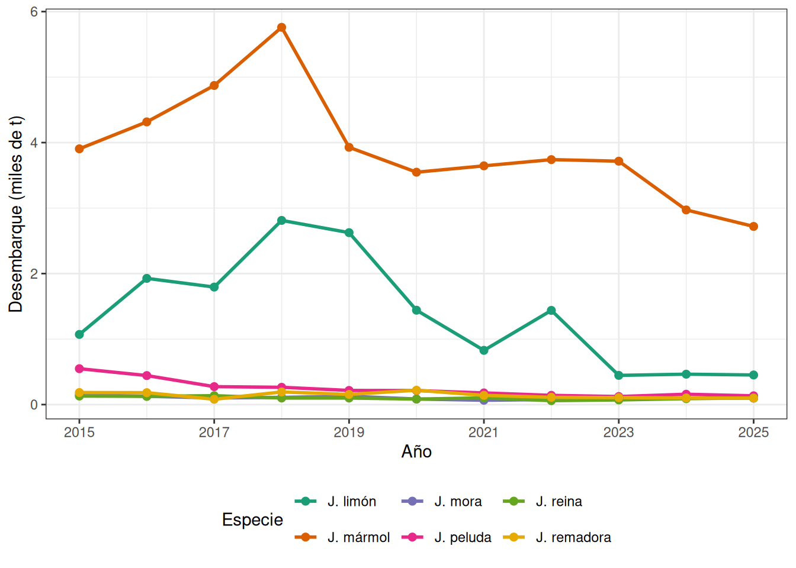
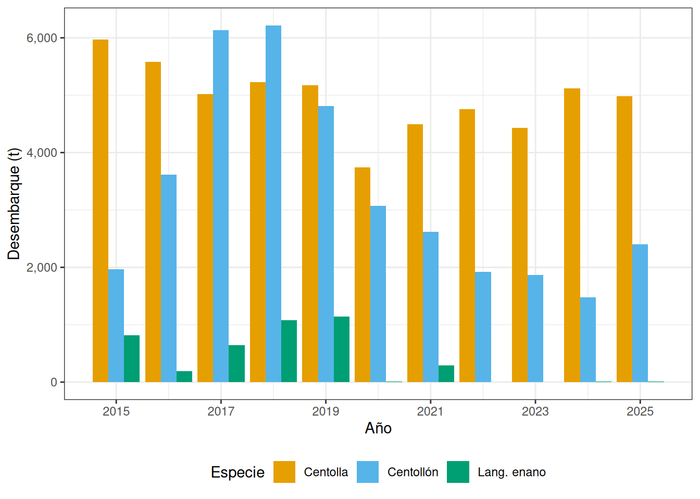
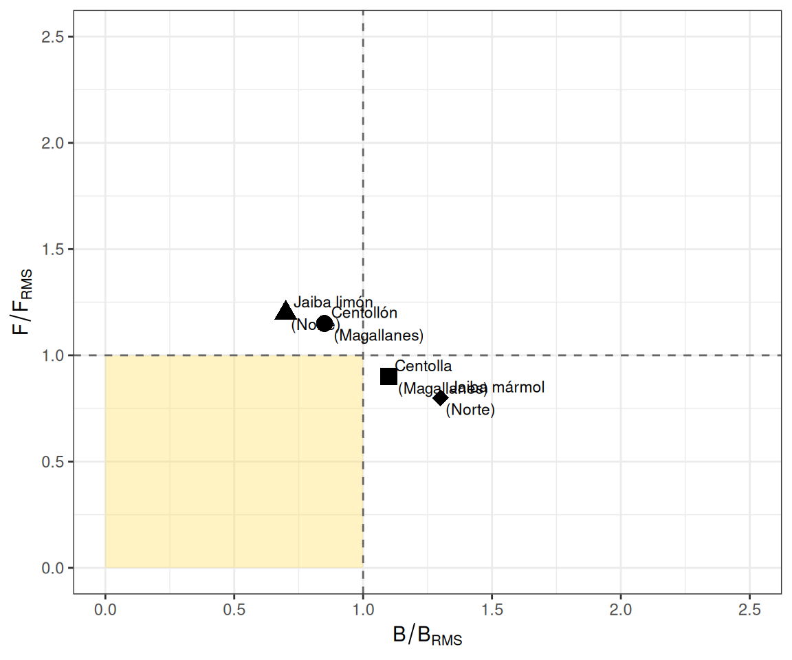

# Crustáceos Bentónicos {#crustaceos-bentonicos}

Los crustáceos bentónicos constituyen un grupo diverso que habita principalmente los
fondos marinos y sustratos rocosos del litoral chileno. A diferencia de las especies
demersales estudiadas en el capítulo anterior, los crustáceos bentónicos como las jaibas,
la centolla y el centollón presentan comportamientos y estrategias reproductivas asociadas
a hábitats estructuralmente complejos: fondos rocosos, praderas de macroalgas, archipiélagos
y canales del sur de Chile. En este capítulo se analizan las principales pesquerías de estos
recursos: las jaibas (*Cancer* spp.), la centolla (*Lithodes santolla*), el centollón
(*Paralomis granulosa*) y el langostino colorado enano (*Grimothea monodon*), que constituye
un morfotipo de especial interés biológico y pesquero.

## Jaibas {#jaibas}

Las jaibas son braquiuros (cangrejos de cuerpo ancho) que conforman las pesquerías de
crustáceos más diversas del litoral chileno. Las principales especies comerciales pertenecen
al género *Cancer* (familia Cancridae):

- **Jaiba mármol** (*Cancer coronatus* sin. *Metacarcinus edwardsii*): es la especie de
  mayor importancia comercial, distribuida desde Arica hasta el Canal de Beagle en fondos
  de 0 a 200 m. Presenta el caparazón de color marrón con manchas blancas y alcanza
  hasta 20 cm de ancho cefalotorácico.
- **Jaiba limón** (*Cancer porteri*): de menor tamaño, distribuida desde Atacama hasta la
  Región de Los Lagos. Habita fondos de 5 a 80 m y coexiste con la jaiba mármol en gran
  parte de su distribución.
- **Jaiba peluda** (*Cancer setosus*): distribuida desde Perú hasta el norte de Chile,
  prefiere sustrato rocoso y presenta abundante vellosidad en las quelas.
- **Jaiba mora** (*Homalaspis plana*): especie de color oscuro característico, asociada a
  fondos rocosos del submareal.
- **Jaiba reina** (*Cancer edwardsii*): de mayor profundidad (hasta 300 m), con caparazón
  de forma ovalada.
- **Jaiba remadora** (*Portunus xantusii*): pelagobentónica, con patas traseras en forma
  de remo adaptadas a la natación.

### Biología de jaibas

Los jaibas son organismos con crecimiento por mudas (ecdisis). En hembras, la copulación
ocurre inmediatamente después de la ecdisis, cuando el caparazón está blando; el macho
sujeta a la hembra hasta que el caparazón se endurece. Las hembras almacenan
esperma en espermatecas para fertilizaciones futuras. El desove produce masas de huevos
que la hembra porta bajo el abdomen (hembras ovígeras) por varios meses. Las larvas pasan
por estadios zoea y megalopa antes de asentarse como juveniles bentónicos.

La estructura de tallas de los desembarques se mide como ancho de caparazón (AC).
La talla mínima legal varía por especie y región, siendo 110 mm AC para la jaiba mármol
en la Zona Centro-Sur. Los artes de pesca autorizados son trampas y buceo con escafandra
o apnea.

### Pesquería de jaibas

Las pesquerías de jaibas son principalmente artesanales y se distribuyen a lo largo
de todo el litoral. La jaiba mármol concentra el mayor desembarque nacional, seguida
por la jaiba limón. Las capturas se realizan con trampas cilíndricas o cuadradas
cebadas con restos de pesca, así como mediante buceo autónomo y apnea.

(\#fig:fig-jaibas)Desembarque de jaibas por especie en Chile, 2015-2025 (SERNAPESCA).

## Centolla y Centollón {#centolla}

La centolla (*Lithodes santolla*) y el centollón (*Paralomis granulosa*) son litódidos
(familia Lithodidae) de gran importancia comercial, concentrados principalmente en la
Región de Magallanes y Antártica Chilena, con poblaciones menores en Aysén y Los Ríos.
La pesquería tiene arraigo histórico desde 1928 y es de carácter artesanal.

### Biología de centolla

La centolla (*Lithodes santolla*) es un crustáceo de cuerpo asimétrico que puede
alcanzar hasta 200 mm de longitud cefalotoráxica (LC) en machos adultos. Habita
fondos blandos y duros entre 0 y 200 m de profundidad, en aguas frías y bien
oxigenadas de canales y fiordos patagónicos. Presenta dimorfismo sexual marcado:
los machos son significativamente más grandes que las hembras.

El crecimiento de la centolla es discontinuo (por mudas). La frecuencia de las mudas
disminuye con la edad; los individuos adultos mudan aproximadamente una vez al año,
en primavera-verano. La fecundidad varía entre 3.000 y 30.000 huevos por hembra.
Las hembras son ovígeras entre mayo y octubre, portando la masa de huevos bajo el
abdomen.

El centollón (*Paralomis granulosa*) presenta similares características ecológicas,
coexistiendo con centolla en Magallanes. Es de menor tamaño (machos hasta 140 mm LC)
y tolera aguas con menor contenido de oxígeno. Su pesquería se desarrolla en las mismas
áreas que la centolla, con temporadas complementarias.

### Pesquería y regulaciones

La pesquería de centolla aplica la **estrategia 3S** (*Season–Sex–Size*):

1. **Season (temporada)**: pesca autorizada entre el 1 de julio y el 30 de noviembre
   de cada año.
2. **Sex (sexo)**: se prohíbe el desembarque y comercialización de hembras de centolla;
   solo se pueden extraer machos.
3. **Size (tamaño)**: talla mínima legal de 120 mm de longitud cefalotoráxica (LC) para
   machos.

Adicionalmente, el único arte de pesca autorizado son las **trampas** y los ejemplares
machos deben ingresar a las plantas de proceso en estado integral (vivos). La inscripción
en el Registro Pesquero Artesanal de la XII Región se encuentra suspendida, limitando
el número de actores activos. La pesquería es compartida con Argentina, lo que añade
complejidad a su administración dado que ambos países aplican medidas de manejo distintas.

El monitoreo pesquero a cargo del IFOP se ha realizado desde 2007 en zonas de pesca y
centros de desembarque de Magallanes. La topografía costera del extremo sur —islas,
archipiélagos, fiordos y canales— determina que las capturas se concentren en zonas
de pesca históricas o recurrentes.

## Langostino Colorado Enano: un Morfotipo {#langostino-enano}

El langostino colorado (*Pleuroncodes monodon*, sinónimo: *Grimothea monodon*) se
conoce principalmente como una especie demersal (capturada con arrastre). Sin embargo,
aparece con frecuencia en las capturas de cerco de anchoveta en la zona norte de Chile
y en el norte del Perú, con una morfología notablemente diferente. Esta forma pelágica,
denominada comúnmente **langostino enano**, fue objeto de debate taxonómico hasta que
análisis genéticos demostraron que ambas formas constituyen **una misma unidad genética**.

### Plasticidad fenotípica heterocrónica

Las diferencias morfológicas entre el langostino demersal y el langostino enano se
explican por **plasticidad fenotípica heterocrónica**: la capacidad del organismo de
alterar su morfología y desarrollo en respuesta a condiciones ambientales. El factor
ambiental más probable es la distribución de aguas con mínimo de oxígeno (ZMO), que
modifica la trayectoria ontogénica de los individuos.

La **heterocronía** implica un cambio en el tiempo de desarrollo que conduce a diferencias
en tamaño y forma respecto al plan corporal ancestral. En el langostino enano, se observa
una madurez sexual adelantada a tallas menores y proporciones corporales diferentes
(cefalotórax más pequeño en relación con el abdomen).

### Importancia pesquera del langostino enano

En Chile, el langostino enano (*Grimothea monodon*) aparece como fauna acompañante
en la pesca de cerco de anchoveta en la I y II Región, con un límite legal de captura
incidental del 3%. En los años El Niño aumenta su disponibilidad en el norte de Chile
por desplazamientos desde Perú. En Perú, se han estimado biomasas acústicas de hasta
3,4 millones de toneladas, ocupando entre 30 y 40 m de profundidad en aguas menores
de 18 °C y salinidades entre 34,7 y 35,1.

Se registran también **varazones** de langostino enano en playas del norte de Chile,
asociados a eventos oceanográficos (surgencia intensa, presencia de ZMO superficial).

## Desembarques Históricos de Crustáceos Bentónicos {#desemb-bentonicos}

Los desembarques de centolla, centollón y langostino enano presentan tendencias
diferenciadas durante el período 2015-2025:

(\#fig:fig-centoller)Desembarque de centolla, centollón y langostino enano en Chile, 2015-2025 (SERNAPESCA).

<table class="table table-striped table-hover" style="font-size: 11px; width: auto !important; margin-left: auto; margin-right: auto;">
<caption style="font-size: initial !important;">(\#tab:tabla-desemb-bent)(\#tab:tabla-desemb-bent)Desembarque (t) de principales crustáceos bentónicos en Chile, 2015-2025 (SERNAPESCA).</caption>
 <thead>
  <tr>
   <th style="text-align:right;"> Año </th>
   <th style="text-align:right;"> Centolla </th>
   <th style="text-align:right;"> Centollón </th>
   <th style="text-align:right;"> J. mármol </th>
   <th style="text-align:right;"> J. limón </th>
   <th style="text-align:right;"> Lang. enano </th>
  </tr>
 </thead>
<tbody>
  <tr>
   <td style="text-align:right;"> 2.015 </td>
   <td style="text-align:right;"> 5.973 </td>
   <td style="text-align:right;"> 1.966 </td>
   <td style="text-align:right;"> 3.905 </td>
   <td style="text-align:right;"> 1.071 </td>
   <td style="text-align:right;"> 819 </td>
  </tr>
  <tr>
   <td style="text-align:right;"> 2.016 </td>
   <td style="text-align:right;"> 5.583 </td>
   <td style="text-align:right;"> 3.614 </td>
   <td style="text-align:right;"> 4.316 </td>
   <td style="text-align:right;"> 1.927 </td>
   <td style="text-align:right;"> 189 </td>
  </tr>
  <tr>
   <td style="text-align:right;"> 2.017 </td>
   <td style="text-align:right;"> 5.024 </td>
   <td style="text-align:right;"> 6.132 </td>
   <td style="text-align:right;"> 4.872 </td>
   <td style="text-align:right;"> 1.794 </td>
   <td style="text-align:right;"> 647 </td>
  </tr>
  <tr>
   <td style="text-align:right;"> 2.018 </td>
   <td style="text-align:right;"> 5.226 </td>
   <td style="text-align:right;"> 6.216 </td>
   <td style="text-align:right;"> 5.760 </td>
   <td style="text-align:right;"> 2.812 </td>
   <td style="text-align:right;"> 1.077 </td>
  </tr>
  <tr>
   <td style="text-align:right;"> 2.019 </td>
   <td style="text-align:right;"> 5.173 </td>
   <td style="text-align:right;"> 4.809 </td>
   <td style="text-align:right;"> 3.928 </td>
   <td style="text-align:right;"> 2.625 </td>
   <td style="text-align:right;"> 1.143 </td>
  </tr>
  <tr>
   <td style="text-align:right;"> 2.020 </td>
   <td style="text-align:right;"> 3.741 </td>
   <td style="text-align:right;"> 3.068 </td>
   <td style="text-align:right;"> 3.548 </td>
   <td style="text-align:right;"> 1.441 </td>
   <td style="text-align:right;"> 8 </td>
  </tr>
  <tr>
   <td style="text-align:right;"> 2.021 </td>
   <td style="text-align:right;"> 4.494 </td>
   <td style="text-align:right;"> 2.621 </td>
   <td style="text-align:right;"> 3.645 </td>
   <td style="text-align:right;"> 828 </td>
   <td style="text-align:right;"> 290 </td>
  </tr>
  <tr>
   <td style="text-align:right;"> 2.022 </td>
   <td style="text-align:right;"> 4.758 </td>
   <td style="text-align:right;"> 1.925 </td>
   <td style="text-align:right;"> 3.740 </td>
   <td style="text-align:right;"> 1.438 </td>
   <td style="text-align:right;"> 0 </td>
  </tr>
  <tr>
   <td style="text-align:right;"> 2.023 </td>
   <td style="text-align:right;"> 4.432 </td>
   <td style="text-align:right;"> 1.866 </td>
   <td style="text-align:right;"> 3.716 </td>
   <td style="text-align:right;"> 446 </td>
   <td style="text-align:right;"> 5 </td>
  </tr>
  <tr>
   <td style="text-align:right;"> 2.024 </td>
   <td style="text-align:right;"> 5.123 </td>
   <td style="text-align:right;"> 1.480 </td>
   <td style="text-align:right;"> 2.972 </td>
   <td style="text-align:right;"> 464 </td>
   <td style="text-align:right;"> 8 </td>
  </tr>
  <tr>
   <td style="text-align:right;"> 2.025 </td>
   <td style="text-align:right;"> 4.984 </td>
   <td style="text-align:right;"> 2.399 </td>
   <td style="text-align:right;"> 2.720 </td>
   <td style="text-align:right;"> 452 </td>
   <td style="text-align:right;"> 8 </td>
  </tr>
</tbody>
</table>

La centolla ha mantenido desembarques relativamente estables entre 3.741 y 5.973 t,
con una caída notoria en 2020 (asociada a restricciones sanitarias por COVID-19). El
centollón muestra mayor variabilidad, con un pico entre 2017 y 2018 (> 6.000 t) y
una caída sostenida hasta 2024 (1.480 t). El langostino enano presenta desembarques
muy irregulares, con años de capturas significativas (> 1.000 t en 2018-2019) y
períodos con registros casi nulos.

## Evaluación de Biomasa y Puntos Biológicos de Referencia {#pbr-bent}

La evaluación de biomasa para centolla y centollón en Magallanes se realiza mediante
modelos de producción excedente o modelos de dinámica de tallas (modelo de Leslie-DeLury
o captura por unidad de esfuerzo, CPUE). La métrica principal es la **captura por trampa
(CPT)**, que actúa como índice de abundancia relativa.

$$\hat{B} = \frac{C}{a \cdot q}$$

donde $C$ es la captura total, $a$ es el esfuerzo de pesca (número de trampas × lances)
y $q$ es el coeficiente de capturabilidad. Los Puntos Biológicos de Referencia (PBR)
estándar son:

<table class="table table-striped table-hover" style="font-size: 11px; margin-left: auto; margin-right: auto;">
<caption style="font-size: initial !important;">(\#tab:tabla-pbr-bent)(\#tab:tabla-pbr-bent)Puntos Biológicos de Referencia (PBR) aplicados en pesquerías de crustáceos bentónicos.</caption>
 <thead>
  <tr>
   <th style="text-align:left;"> Punto de Referencia </th>
   <th style="text-align:left;"> Descripción </th>
   <th style="text-align:left;"> Interpretación </th>
  </tr>
 </thead>
<tbody>
  <tr>
   <td style="text-align:left;"> B₀ (100%) </td>
   <td style="text-align:left;"> Biomasa virginal: estado del recurso sin explotación </td>
   <td style="text-align:left;"> Referencia teórica de capacidad de carga poblacional </td>
  </tr>
  <tr>
   <td style="text-align:left;"> B_RMS (40% B₀) </td>
   <td style="text-align:left;"> Biomasa de máximo rendimiento sostenible: objetivo de manejo </td>
   <td style="text-align:left;"> Nivel de biomasa que permite maximizar el rendimiento a largo plazo </td>
  </tr>
  <tr>
   <td style="text-align:left;"> B_LÍMITE (20% B₀) </td>
   <td style="text-align:left;"> Biomasa mínima aceptable: umbral de colapso pesquero </td>
   <td style="text-align:left;"> Por debajo de este umbral la pesquería se considera sobreexplotada </td>
  </tr>
</tbody>
</table>

## Estado de las Pesquerías de Crustáceos Bentónicos {#estado-bent}

(\#fig:kobe-bent)Diagrama de Kobe para pesquerías de crustáceos bentónicos de Chile. Los colores indican el estado de la pesquería: verde (subexplotado), amarillo (en desarrollo), rojo (sobreexplotado).

<table class="table table-striped table-hover" style="font-size: 11px; width: auto !important; margin-left: auto; margin-right: auto;">
<caption style="font-size: initial !important;">(\#tab:tabla-estado-bent)(\#tab:tabla-estado-bent)Estado de las principales pesquerías de crustáceos bentónicos en Chile.</caption>
 <thead>
  <tr>
   <th style="text-align:left;"> Pesquería </th>
   <th style="text-align:right;"> B/B_RMS </th>
   <th style="text-align:right;"> F/F_RMS </th>
   <th style="text-align:left;"> Estado </th>
  </tr>
 </thead>
<tbody>
  <tr>
   <td style="text-align:left;"> Centolla (Magallanes) </td>
   <td style="text-align:right;"> 1.10 </td>
   <td style="text-align:right;"> 0.90 </td>
   <td style="text-align:left;font-weight: bold;color: rgba(44, 160, 44, 1) !important;"> Subexplotada </td>
  </tr>
  <tr>
   <td style="text-align:left;"> Centollón (Magallanes) </td>
   <td style="text-align:right;"> 0.85 </td>
   <td style="text-align:right;"> 1.15 </td>
   <td style="text-align:left;font-weight: bold;color: rgba(214, 39, 40, 1) !important;"> Sobreexplotada </td>
  </tr>
  <tr>
   <td style="text-align:left;"> Jaiba mármol (Norte) </td>
   <td style="text-align:right;"> 1.30 </td>
   <td style="text-align:right;"> 0.80 </td>
   <td style="text-align:left;font-weight: bold;color: rgba(44, 160, 44, 1) !important;"> Subexplotada </td>
  </tr>
  <tr>
   <td style="text-align:left;"> Jaiba limón (Norte) </td>
   <td style="text-align:right;"> 0.70 </td>
   <td style="text-align:right;"> 1.20 </td>
   <td style="text-align:left;font-weight: bold;color: rgba(214, 39, 40, 1) !important;"> Sobreexplotada </td>
  </tr>
</tbody>
</table>

> **Nota:** El diagrama de Kobe y los valores de estado corresponden a una representación
> esquemática con fines pedagógicos. Los valores reales de biomasa relativa y mortalidad
> por pesca se obtienen de los informes de seguimiento pesquero de IFOP y SUBPESCA.

## Síntesis {#sintesis-bent}

Las pesquerías de crustáceos bentónicos chilenos presentan características particulares
que las distinguen de las pesquerías pelágicas y demersales:

La **pesquería de centolla** es la más emblemática del extremo sur, con tradición
histórica de casi un siglo. Su administración mediante la estrategia 3S (temporada,
sexo y talla) ha permitido mantener capturas relativamente estables, aunque la
condición de pesquería compartida con Argentina y la dependencia de zonas históricas
de pesca representan riesgos de manejo.

Las **pesquerías de jaibas** son las de mayor diversidad específica y extensión
geográfica, con la jaiba mármol como especie dominante a nivel nacional. La presión
pesquera sobre la jaiba limón ha aumentado notablemente en los últimos años con
signos de sobreexplotación en algunas regiones.

El **langostino enano** (*Grimothea monodon*) ilustra un fenómeno biológico fascinante:
la plasticidad fenotípica heterocrónica en respuesta a gradientes ambientales (ZMO).
Aunque sus desembarques formales son bajos, su importancia ecológica en el ecosistema
del norte de Humboldt es significativa.

## Glosario {#glosario-bent}

**Braquiura**: infraorden de crustáceos decápodos caracterizados por tener el abdomen
reducido y plegado bajo el cefalotórax; incluye a las jaibas y cangrejos.

**Caparazón**: estructura rígida que cubre el cefalotórax de los crustáceos, formada
por calcificación de la cutícula.

**CPUE (Captura por Unidad de Esfuerzo)**: índice de abundancia relativa que relaciona
la captura con el esfuerzo de pesca; se utiliza como proxy de la biomasa disponible.

**Ecdisis**: proceso de muda del exoesqueleto en crustáceos, necesario para el
crecimiento; durante la muda el animal queda vulnerable.

**Estrategia 3S**: sistema de regulación pesquera basado en temporada (*Season*), sexo
(*Sex*) y talla (*Size*); aplicado en la pesquería de centolla.

**Hembra ovígera**: hembra que porta la masa de huevos bajo el abdomen; en la mayoría
de las pesquerías se protegen de la captura.

**Heterocronía**: cambio evolutivo en el tiempo o la tasa de desarrollo de un organismo
respecto a sus ancestros; genera variaciones morfológicas entre individuos de la misma
especie.

**Litódido**: familia de crustáceos decápodos (Lithodidae) de cuerpo casi simétrico con
un abdomen asimétrico reducido; incluye centolla y centollón.

**Longitud cefalotoráxica (LC)**: medida estándar usada en centolla y centollón,
correspondiente a la longitud del caparazón desde el rostro hasta el margen posterior.

**Morfotipo**: variante morfológica dentro de una misma especie, determinada por
condiciones ambientales y no por diferencias genéticas.

**Plasticidad fenotípica**: capacidad de un genotipo para expresar distintos fenotipos
en respuesta a variaciones ambientales.

**Talla mínima legal (TML)**: tamaño mínimo al que un organismo puede ser extraído
legalmente; busca proteger a los juveniles y garantizar la reproducción.

**Trampa**: arte de pesca pasiva, tipo nasa o cilindro metálico cebado, utilizado en
la captura de jaibas, centolla y centollón.

**Zona Mínima de Oxígeno (ZMO)**: capa de la columna de agua con concentraciones muy
bajas de oxígeno disuelto; influye en la distribución vertical de organismos marinos,
incluyendo la forma pelágica del langostino enano.

## Preguntas de Autoevaluación {#preguntas-bent}

**Nivel básico:**

1. ¿Cuáles son las dos principales especies de jaibas comerciales en Chile y a qué
   género pertenecen?
2. ¿Qué significan las tres "S" de la estrategia 3S aplicada en la pesquería de
   centolla?
3. ¿Cuál es la talla mínima legal de extracción para machos de centolla?

**Nivel intermedio:**

4. Explique por qué en la pesquería de centolla se permite solo la extracción de machos.
   ¿Qué implicaciones tiene esto para la estructura de la población?
5. ¿Qué es la plasticidad fenotípica heterocrónica y cómo explica la existencia del
   morfotipo "langostino enano" en la misma especie que el langostino colorado demersal?
6. Compare los patrones de desembarque de centolla y centollón en el período 2015-2025.
   ¿Qué factores podrían explicar las diferencias observadas?

**Nivel avanzado:**

7. Analice las ventajas y limitaciones de utilizar la captura por trampa (CPT) como
   índice de abundancia en la evaluación de la pesquería de centolla. ¿Cuáles son
   los supuestos que deben cumplirse?
8. En el diagrama de Kobe, la pesquería de centollón aparece en el cuadrante de
   sobreexplotación. Proponga al menos tres medidas de manejo adicionales a las ya
   existentes para recuperar la pesquería. Justifique su propuesta con criterios
   biológicos y socioeconómicos.
9. La pesquería de centolla es compartida entre Chile y Argentina. Discuta los
   desafíos para la co-gestión transfronteriza de un recurso bentónico migratorio
   y proponga un marco de gobernanza basado en la literatura disponible.

## Referencias {#refs-bent}

Daza, E., Almonacid, E., y Hernández, R. (2020). *Seguimiento Pesquerías Crustáceos
Bentónicos, 2019: Recursos Centolla y Centollón, Región de Magallanes y Antártica
Chilena*. Informe Final Convenio de Desempeño 2019. Instituto de Fomento Pesquero
(IFOP). 150 pp.

Mora, C. (2023). *Dinámica poblacional de centolla (Lithodes santolla) en bahía Nassau,
Magallanes*. Tesis de Magíster en Ciencias Pesqueras, Universidad de Concepción. 98 pp.

Pinochet, J., Cubillos, L.A., y colaboradores. (2022). Evaluación del estado de
explotación de crustáceos bentónicos en Chile austral. *Latin American Journal of
Aquatic Research*, 50(3), 350-365.

SERNAPESCA. (2025). *Anuario Estadístico de Pesca y Acuicultura 2025*. Servicio
Nacional de Pesca y Acuicultura. Valparaíso, Chile.

SUBPESCA. (2024). *Cuota global anual de captura para centolla y centollón, Región de
Magallanes 2024*. Resolución Exenta. Subsecretaría de Pesca y Acuicultura. Valparaíso.
